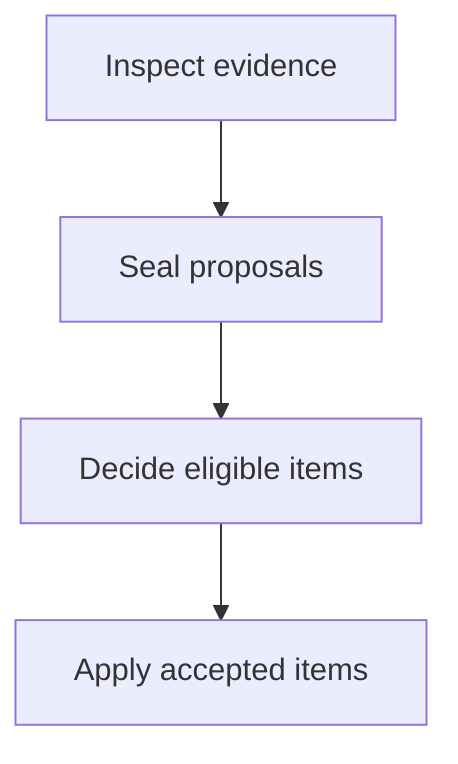

Use `defineDocsConfig()` for type inference and immediate validation of unknown
keys:

```ts
import { defineDocsConfig } from "@tenphi/cookbook";

export default defineDocsConfig({
  site: { title: "Example" },
  content: { sources: [{ file: "README.md", route: "/" }] },
});
```

Cookbook validates the configuration when it loads. Unknown top-level and
section keys are errors.

## Site

```ts
site: {
  title: "Example Project",
  version: "1.2.3",
  description: "Documentation for Example Project",
  url: "https://docs.example.com",
  repository: "https://github.com/example/project"
}
```

`version` is the documented package version shown beside the site title. A site
with one locked npm package source infers its version automatically; set this
field for local or multi-package documentation. Read it from the package
manifest when possible so it remains current. `url` is the canonical deployed
origin. Set Astro's `site` value too when the host needs absolute canonical URLs
or sitemap metadata.

## Head

Add custom elements to every page's `<head>` with the `head` array. This is the
preferred configuration for analytics scripts and other remote resources:

```ts
head: [
  {
    tag: "script",
    attrs: {
      defer: true,
      src: "https://analytics.example.com/script.js",
      "data-website-id": "YOUR-WEBSITE-ID",
    },
  },
],
```

Each entry accepts a `tag`, optional string or boolean `attrs`, and optional
string `content`. Cookbook renders these entries directly as HTML elements;
they do not pass through Astro's script or style processing. Use a `Head`
component override when a local asset needs Astro processing.

## Content

```ts
content: {
  sources: [
    { file: "README.md", route: "/" },
    { glob: "docs/**/*.{md,mdx}", base: "docs" }
  ],
  allowOutsideRoot: false
}
```

See [Content sources](./content-sources.md) for every declaration and its route
rules.

## Navigation

Navigation can mix direct routes, nested groups, autogenerated directories,
and external links. Groups are recursive and can be nested to any practical
depth. Use the object form to add an optional primary tab row above the
documentation shell:

```ts
navigation: {
  tabs: [
    {
      label: "Guides",
      link: "/",
      items: [
        "/",
        {
          label: "Build",
          items: [
            {
              label: "Frontend",
              items: [
                {
                  label: "Frameworks",
                  items: ["/react", "/vue"]
                }
              ]
            }
          ]
        }
      ]
    },
    {
      label: "API",
      link: "/reference",
      items: [
        {
          label: "Reference",
          autogenerate: { directory: "/reference" }
        }
      ]
    },
    { label: "Playground", link: "https://example.com/playground" }
  ],
  items: [
    "/",
    {
      label: "Start here",
      items: ["/getting-started", "/configuration"]
    },
    {
      label: "Reference",
      autogenerate: { directory: "/reference" }
    }
  ]
}
```

Tabs are omitted when `tabs` is not set. Give a tab `items` to replace the
sidebar for that section. Those items also establish section membership, so a
tab can own routes that do not share its URL prefix. A tab stays active for
pages nested below its link; `/` matches only the home page. When multiple tabs
could match, an exact tab link wins, followed by the longest link prefix and
then sidebar membership. Tabs without `items` use the top-level `items`
fallback. Every internal route named anywhere in navigation must exist.

## Theme

```ts
theme: {
  brand: {
    from: "#2f5bff",
    contrast: { apca: 45 }
  },
  palette: {
    surface: "#fcfcff",
    text: "#20232a",
    textSoft: "#626875"
  },
  tokens: {
    "$radius": "6px",
    "$card-radius": "10px",
    "$border-width": "1px",
    "$layout-width": "87.5rem",
    "$content-width": "58rem",
    "$sidebar-width": "17.5rem"
  },
  states: {},
  presets: {
    body: { fontFamily: "Inter, sans-serif", boldFontWeight: 680 },
    heading: {
      fontFamily: "Newsreader, serif",
      fontWeight: 650,
      boldFontWeight: 740
    }
  },
  styles: {
    ThemeSelect: {
      Select: { border: "#border-strong" },
      Picker: { shadow: "0 1rem 3rem #shadow" }
    }
  },
  contrastLevel: "auto"
}
```

The default brand is `#315efb`; controls use a `6px` radius and cards use
`10px`. Onest is the default body and heading family, while JetBrains Mono is
used for code. The default layout is capped at `87.5rem` (1400px), matching the
Tasty site, with a `58rem` reading column and a `17.5rem` sidebar. `palette`
supplies semantic Glaze inputs rather than component colors,
so the whole interface continues to adapt in dark and high-contrast modes. A requested APCA floor below 45 requires the explicit
`unsafeContrast: true` escape hatch. Learn more in
[Theme and components](./theme-and-components.md).

`theme.styles` is keyed by Cookbook UI surface name. A plain Tasty style object
contains only the properties to override; Cookbook deep-merges it into that
surface's complete base object internally. Structural Astro overrides under
`components.overrides` remain available when styling alone is insufficient.
`theme.states` registers additional Tasty state shorthands, and `contrastLevel`
is forwarded to Glaze's palette resolution.
The built-in documentation navigation surfaces are available as `Sidebar`,
`TableOfContents`, and `MobileTableOfContents`; see
[Theme and components](./theme-and-components.md#style-customization) for their
complete sub-element lists.

## Markdown

```ts
markdown: {
  stripLeadingBadges: true,
}
```

`stripLeadingBadges` removes badge-only paragraphs at the start of a page and
defaults to `true`. Package Markdown still rejects script-capable HTML, and
package MDX requires an explicit `trust: "mdx"` source declaration.

Configure renderer-level Markdown options such as custom remark or rehype
plugins and Shiki languages through Astro's top-level `markdown` configuration.
Cookbook preserves those settings while adding its own build-time transforms.

Cookbook renders fenced `mermaid` blocks as responsive, theme-aware SVG during
the static build. Flowcharts, state, sequence, class, and entity-relationship
diagrams are supported. Invalid or unsupported diagrams remain visible as
source code.

````markdown

````


## Search

```ts
search: {
  enabled: true,
},
```

Search is generated locally with Pagefind during a static build. Disable it
for hosts or fixtures that do not need an index.

## Components

```ts
components: {
  overrides: {
    Header: "./src/components/Header.astro",
    Footer: "./src/components/Footer.astro"
  }
}
```

Component replacement is the advanced escape hatch. Prefer theme tokens and
named styles for visual changes that do not need new structure.

Cookbook uses its built-in footer by default, including the “Generated with
Cookbook” credit. Replace the complete footer with the `Footer` component path
shown above, or remove it with:

```ts
components: {
  overrides: {
    Footer: false,
  },
},
```

Disabling the complete footer also removes its edit link, last-updated metadata,
and previous/next-page navigation.

## Build

```ts
build: {
  strict: true,
  ci: process.env.CI === "true",
  base: "/",
  cacheDir: "",
  maxArtifactBytes: 25 * 1024 * 1024,
  maxUnpackedBytes: 100 * 1024 * 1024,
  maxFiles: 10_000,
  maxPathDepth: 24,
  maxAssetBytes: 20 * 1024 * 1024
}
```

`strict` makes missing internal links errors instead of warnings. `ci` makes
missing heading fragments errors and defaults to `true` when `CI=true`. `base`
must match Astro's base path for project sites such as
`https://owner.github.io/repository/`. An empty `cacheDir` uses
`~/.cache/cookbook`; set an explicit path to relocate downloaded package
artifacts. Package limits protect builds from unexpected registry artifacts;
raise them deliberately for a reviewed package.
