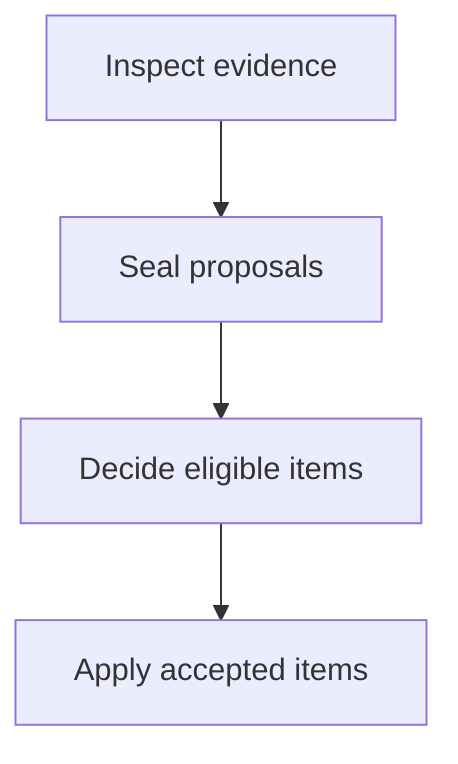

Use `defineDocsConfig()` for type inference and immediate validation of unknown
keys:

```ts
import { defineDocsConfig } from "@tenphi/cookbook/config";

export default defineDocsConfig({
  site: { title: "Example" },
  content: { sources: [{ file: "README.md", route: "/" }] },
});
```

Cookbook validates the configuration when it loads. Unknown top-level and
section keys are errors.

## Project resolution and presets

`cookbook()` and CLI commands discover the same `docs.config.ts`. Set `root`
to a directory relative to this file to change where content, local assets,
and the lock live. `--root` chooses the CLI's configuration search directory;
`--config` chooses a config file. An inline integration `config` object skips
discovery and resolves its `root` relative to the integration root.

Use `mergeDocsConfig(preset, overrides)` to compose shared configuration. Objects
merge recursively and arrays replace; Tasty styles preserve default values when
adding conditional overrides. Neither input is mutated. See
[working examples](./examples.md#share-configuration-and-themes).

## Redirects

Map old routes to collected document routes:

```ts
redirects: { "/old-guide": "/getting-started" }
```

Pages can also declare `aliases: ["/old-guide"]` in frontmatter. Page aliases are
relative to the source mount. Cookbook rejects collisions, cycles, and missing
targets, collapses chains, and lets Astro emit static redirects. Internal links
using an alias are rewritten to the canonical route.

## Site

```ts
site: {
  title: "Example Project",
  version: "1.2.3",
  description: "Documentation for Example Project",
  url: "https://docs.example.com",
  repository: "https://github.com/example/project",
  favicon: "./assets/brand.svg"
}
```

`version` is the documented package version shown beside the site title. A site
with one locked npm package source infers its version automatically; set this
field for local or multi-package documentation. Read it from the package
manifest when possible so it remains current. `url` configures Astro's canonical
site origin and sitemap metadata. If Astro also declares `site`, the values must
match. `repository` adds a source link to the header.

### Site icons

Cookbook ships its book mark as the default favicon. Set `site.favicon` to a
local SVG, PNG, JPEG, WebP, AVIF, or GIF when the documentation should use the
project's own artwork:

```ts
site: {
  title: "Example Project",
  favicon: {
    source: "./assets/brand.svg",
    background: "#315efb"
  }
}
```

Paths are resolved from the project root. The string shorthand sets only the
source, as in `favicon: "./assets/brand.svg"`. `background` controls the opaque
canvas used for the Apple touch icon and maskable application icons; it defaults
to Cookbook blue.

At development and build time, Cookbook creates a scalable favicon when the
source is SVG, a 32×32 PNG fallback, a 180×180 Apple touch icon, 192×192 and
512×512 application icons, safe-zone maskable variants, and a web app manifest.
It also emits modern `rel="icon"`, `rel="apple-touch-icon"`, and
`rel="manifest"` links plus light and dark `theme-color` metadata. Generated
files live under `/_cookbook/icons/`, respect Astro's `base`, and do not modify
the project's `public/` directory. The maskable variants render the source artwork
at 80% of the canvas on the configured opaque background.

These outputs follow current browser guidance for
[multiple icon formats and sizes](https://developer.mozilla.org/en-US/docs/Web/Progressive_web_apps/How_to/Define_app_icons),
[manifest icon purposes](https://developer.mozilla.org/en-US/docs/Web/Progressive_web_apps/Manifest/Reference/icons),
and the
[180×180 Apple touch icon](https://developer.apple.com/library/archive/documentation/AppleApplications/Reference/SafariWebContent/ConfiguringWebApplications/ConfiguringWebApplications.html).

## Head

Add custom elements to every page's `<head>` with the `head` array. This is the
preferred configuration for analytics scripts and other remote resources:

```ts
head: [
  {
    tag: "script",
    attrs: {
      defer: true,
      src: "https://analytics.example.com/script.js",
      "data-website-id": "YOUR-WEBSITE-ID",
    },
  },
],
```

Each entry accepts a `tag`, optional string or boolean `attrs`, and optional
string `content`. Cookbook renders these entries directly as HTML elements;
they do not pass through Astro's script or style processing. Use a `Head`
component override when a local asset needs Astro processing.

## Page metadata

Enable source-aware edit links and Git timestamps for the page footer:

```ts
editLink: {
  baseUrl: "https://github.com/example/project/edit/main/"
},
lastUpdated: true,
```

Cookbook joins `editLink.baseUrl` with each original repository-relative source
path, not a generated content-collection path. Set `editUrl: false` or
`lastUpdated: false` in a page's frontmatter to opt that page out; a string
`editUrl` or date-valued `lastUpdated` overrides the generated value. Package
sources show a timestamp only when their materialized file has Git history or
the page supplies one explicitly.

These settings intentionally mirror Starlight's
[`editLink`](https://starlight.astro.build/reference/configuration/#editlink)
and
[`lastUpdated`](https://starlight.astro.build/reference/configuration/#lastupdated)
configuration while preserving Cookbook's original source paths.

Cookbook also accepts Starlight-compatible page presentation frontmatter:

```yaml
tableOfContents:
  minHeadingLevel: 2
  maxHeadingLevel: 4
pagefind: true
banner:
  content: This API is experimental.
hero:
  image:
    file: ./assets/product.svg
sidebar:
  label: Quick start
  order: 1
  group: Guides
```

Set `sidebar: false` to omit a page from generated sidebars. `label`, `order`,
and `group` affect both the default sidebar and autogenerated navigation
directories. Relative hero images are validated, content-hashed, and copied
with the page's other local assets. Unrecognized frontmatter is preserved as graph entry `metadata`, outside the
renderer frontmatter. Use `content.frontmatter: "reject"` to reject unrelated
fields. Other supported fields include `aliases`, `template`, `hero`, `editUrl`,
`lastUpdated`, `prev`, `next`, `head`, `draft`, and `slug`.

## Languages

Expose Starlight's multilingual routing and language picker directly:

```ts
locales: {
  root: { label: "English", lang: "en" },
  fr: { label: "Français", lang: "fr" },
  ar: { label: "العربية", lang: "ar", dir: "rtl" }
},
defaultLocale: "root",
```

Locale keys other than `root` are URL prefixes. A source routed to `/fr/guide`
is the French counterpart of `/guide`; `defaultLocale` provides fallback
content when a translated route is missing. See Starlight's
[internationalization guide](https://starlight.astro.build/guides/i18n/) for
the shared routing and fallback behavior.

## Content

```ts
content: {
  sources: [
    { file: "README.md", route: "/" },
    { glob: "docs/**/*.{md,mdx}", base: "docs" }
  ],
  allowOutsideRoot: false,
  localizeRepositoryLinks: false,
  frontmatter: "preserve"
}
```

See [Content sources](./content-sources.md) for every declaration and its route
rules. Enable `localizeRepositoryLinks` to turn absolute repository `blob`,
`tree`, `raw`, or Bitbucket `src` links back into local Cookbook routes when a
matching page was collected. Cookbook uses `site.repository` for local sources
and each package manifest's `repository` metadata for package sources.

## Navigation

Navigation can mix direct routes, nested groups, autogenerated directories,
and external links. Groups are recursive and can be nested to any practical
depth. Use the object form to add an optional primary tab row above the
documentation shell:

```ts
navigation: {
  tabs: [
    {
      label: "Guides",
      link: "/",
      items: [
        "/",
        {
          label: "Build",
          items: [
            {
              label: "Frontend",
              items: [
                {
                  label: "Frameworks",
                  items: ["/react", "/vue"]
                }
              ]
            }
          ]
        }
      ]
    },
    {
      label: "API",
      link: "/reference",
      items: [
        {
          label: "Reference",
          autogenerate: { directory: "/reference" }
        }
      ]
    },
    { label: "Playground", link: "https://example.com/playground" }
  ],
  items: [
    "/",
    {
      label: "Start here",
      items: ["/getting-started", "/configuration"]
    },
    {
      label: "Reference",
      autogenerate: { directory: "/reference" }
    }
  ]
}
```

Give a group an optional `link` to use its header as a parent page:

```ts
{
  label: "Charts",
  link: "/charts",
  items: [
    {
      label: "Chart types",
      link: "/charts/types",
      autogenerate: { directory: "/charts/types" }
    }
  ]
}
```

Group links must name existing root-relative page routes, without the deployment
base, a query, or a fragment. The parent page is omitted from its children if it
also appears in the manual list or autogenerated directory. It remains in
previous/next page navigation. A group with no remaining children becomes a
regular page link.

Top-level sections stay flat; their linked headings navigate to their pages.
For nested groups, clicking an unselected header or its chevron selects the parent
page and opens its children, keeping them open if already expanded. Clicking the
selected parent toggles its children without reloading. Selecting and collapsing
an open, unselected group therefore takes two clicks. Enter and Space work too, while modified clicks and opening a link
in a new tab retain normal link behavior. Groups without a `link` only toggle.
Only the selected page is highlighted; its ancestors keep their normal styling.

Tabs are omitted when `tabs` is not set. Give a tab `items` to replace the
sidebar for that section. Those items also establish section membership, so a
tab can own routes that do not share its URL prefix. A tab stays active for
pages nested below its link; `/` matches only the home page. When multiple tabs
could match, an exact tab link wins, followed by the longest link prefix and
then sidebar membership. Tabs without `items` use the top-level `items`
fallback. Every internal route named anywhere in navigation must exist.

## Theme

```ts
theme: {
  brand: {
    from: "#2f5bff",
    contrast: { apca: 45 }
  },
  palette: {
    surface: "#fcfcff",
    text: "#20232a",
    textSoft: "#626875"
  },
  tokens: {
    "$radius": "8px",
    "$card-radius": "16px",
    "$border-width": "1px",
    "$layout-width": "87.5rem",
    "$content-width": "58rem",
    "$sidebar-width": "17.5rem"
  },
  states: {},
  presets: {
    body: { fontFamily: "Inter, sans-serif", boldFontWeight: 680 },
    heading: {
      fontFamily: "Newsreader, serif",
      fontWeight: 650,
      boldFontWeight: 740
    }
  },
  styles: {
    ThemeSelect: {
      Select: { border: "#border-strong" },
      Picker: { shadow: "0 1rem 3rem #shadow" }
    }
  },
  contrastLevel: "auto"
}
```

The default brand is `okhsl(266 68% 48%)`, a blue with 68% saturation; controls
use an `8px` radius and cards use `16px`. Onest is the default body and heading family, while JetBrains Mono is
used for code. The default layout is capped at `87.5rem` (1400px), matching the
Tasty site, with a `58rem` reading column and a `17.5rem` sidebar. `palette`
supplies semantic Glaze inputs rather than component colors,
so the whole interface continues to adapt in dark and high-contrast modes. A requested APCA floor below 45 requires the explicit
`unsafeContrast: true` escape hatch. Learn more in
[Theme and components](./theme-and-components.md).

`theme.styles` is keyed by Cookbook UI surface name. A plain Tasty style object
contains only the properties to override; Cookbook deep-merges it into that
surface's complete base object internally. Unknown built-in names and sub-elements are rejected. Register custom
component names and their overrides in `theme.customStyles`. Structural Astro overrides under
`components.overrides` remain available when styling alone is insufficient.
`theme.states` registers additional Tasty state shorthands, and `contrastLevel`
is forwarded to Glaze's palette resolution.
The built-in documentation navigation surfaces are available as `Sidebar`,
`TableOfContents`, `MobileMenuToggle`, and `MobileNavigationTabs`; see
[Theme and components](./theme-and-components.md#style-customization) for their
complete sub-element lists.

## Markdown

```ts
markdown: {
  stripLeadingBadges: true,
  rawHtml: "sanitize",
}
```

`stripLeadingBadges` removes badge-only paragraphs at the start of a page and
defaults to `true`. `rawHtml` accepts `"allow"`, `"sanitize"`, `"strip"`, or `"reject"`.
The default `sanitize` policy preserves safe elements, including `details`,
`summary`, tables, and inline emphasis, while removing executable markup,
event handlers, and presentational attributes. Links and images in sanitized
HTML pass through the content graph. `strip` removes HTML with a warning,
`allow` preserves trusted HTML, and `reject` reports a graph error. Package Markdown in safe mode is
always sanitized even when the global policy is `"allow"`, and package MDX
requires an explicit `trust: "mdx"` source declaration.

Configure renderer-level Markdown options such as custom remark or rehype
plugins and Shiki languages through Astro's top-level `markdown` configuration.
Cookbook preserves those settings while adding its own build-time transforms.

Cookbook renders fenced `mermaid` blocks as responsive, theme-aware SVG during
the static build. Flowcharts, state, sequence, class, and entity-relationship
diagrams are supported. Invalid or unsupported diagrams remain visible as
source code.

````markdown

````


## Search

```ts
search: {
  enabled: true,
},
```

Search is generated locally with Pagefind during a static build. Disable it
for hosts or fixtures that do not need an index.

## Components

```ts
components: {
  overrides: {
    Header: "./src/components/Header.astro",
    Footer: "./src/components/Footer.astro"
  }
}
```

Component replacement is the advanced escape hatch. Prefer theme tokens and
named styles for visual changes that do not need new structure.

Cookbook uses its built-in footer by default, including the “Generated with
Cookbook” credit. Replace the complete footer with the `Footer` component path
shown above, or remove it with:

```ts
components: {
  overrides: {
    Footer: false,
  },
},
```

Disabling the complete footer also removes its edit link, last-updated metadata,
and previous/next-page navigation.

## Build

```ts
build: {
  strict: true,
  ci: process.env.CI === "true",
  cacheDir: "",
  maxArtifactBytes: 25 * 1024 * 1024,
  maxUnpackedBytes: 100 * 1024 * 1024,
  maxFiles: 10_000,
  maxPathDepth: 24,
  maxAssetBytes: 20 * 1024 * 1024
}
```

`strict` makes missing internal links errors instead of warnings. `ci` makes
missing heading fragments errors and defaults to `true` when `CI=true`.
Cookbook derives its public base path from Astro's top-level `base` setting so
routes and assets cannot drift between two configurations. An empty `cacheDir`
uses `~/.cache/cookbook`; set an explicit path to relocate downloaded package
artifacts. Package limits protect builds from unexpected registry artifacts;
raise them deliberately for a reviewed package.

## Header buttons

Configure the top bar with `site.headerLinks`. Links appear beside search on
larger screens and in a More popover below 50rem. The desktop header supports
primary buttons; More uses a compact, left-aligned list of uniform navigation
links. Omit the array (or use `[]`) to hide More.

```ts
export default defineDocsConfig({
  site: {
    headerLinks: [
      {
        label: "Changelog",
        link: "https://example.com/changelog",
        newTab: true,
      },
      { label: "Get started", link: "/getting-started", variant: "primary" },
    ],
  },
});
```

Each entry requires a non-empty `label` and a `link` (an HTTP(S) URL,
root-relative route, or fragment). Cookbook prefixes root-relative links with
the Astro base. `variant` is `default` or `primary` and applies on desktop;
`newTab` defaults to false
and adds safe new-window attributes when enabled. Customize the complete
button and popover style tree through `theme.styles.HeaderLinks`.

`theme.palette.header` sets the translucent header's color seed. It defaults
to `theme.palette.surface`; Glaze resolves it for light, dark, and both high
contrast modes. Adjust blur and other header styling via `theme.styles.HeaderFrame`.
`theme.palette.overlay` controls the fixed underlay color, defaulting to black at
50% opacity in every scheme. The mobile drawer uses the Glaze shadow token and
a 120ms slide transition; customize these through `theme.styles.Sidebar`.
